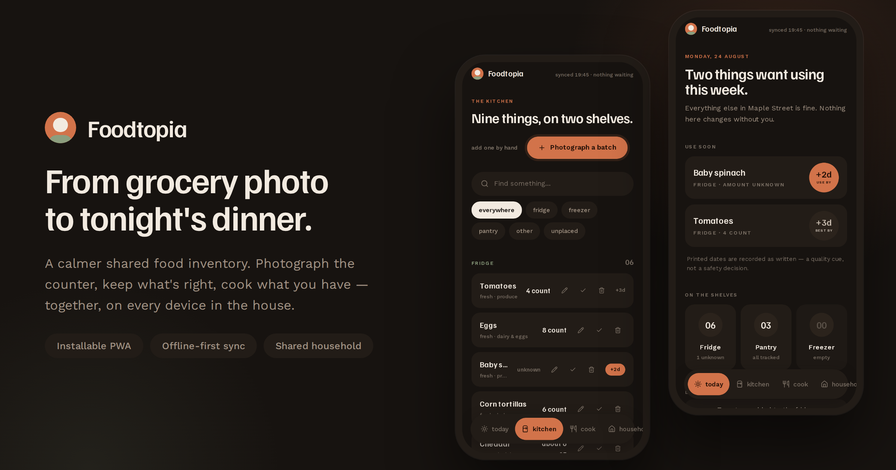
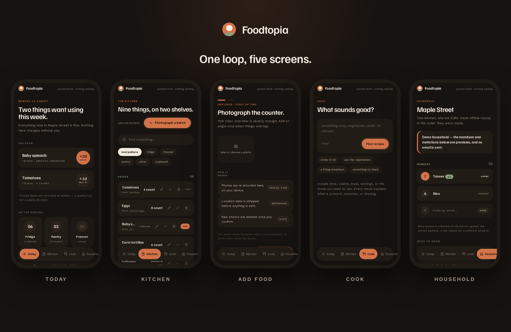
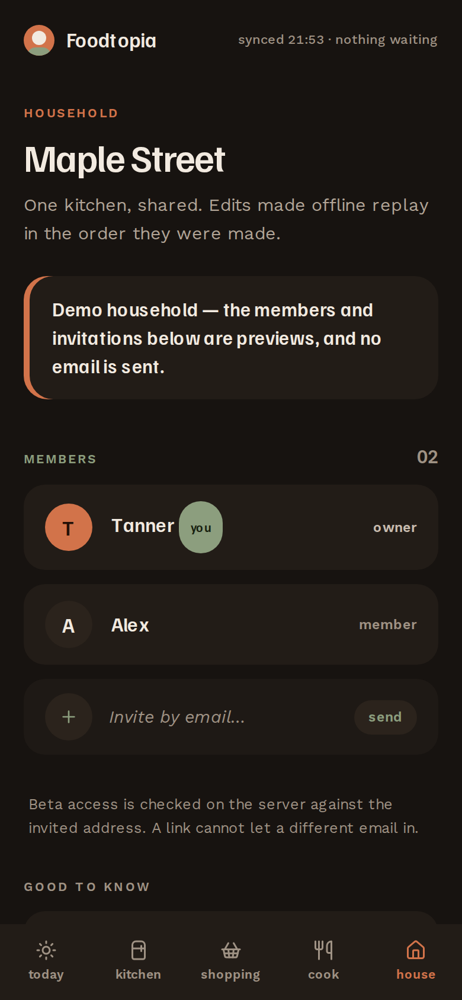

<div align="center">



# Foodtopia

**A calmer shared food inventory — from grocery photo to tonight's dinner.**

An invite-only, mobile-first household food inventory PWA built on one dependable loop:

**Photograph food → review AI suggestions → update a shared inventory → choose a feasible recipe → reconcile what was used.**

[](https://github.com/TannerMidd/foodtopia/actions/workflows/ci.yml)


</div>

---

## Highlights

- **Photograph, don't type.** Stage 1–3 clear photos; on-device re-encoding (1600 px max edge, EXIF stripped, 5 MB cap) before anything is sent. Model output is always a draft — it cannot mutate inventory until you confirm the batch.
- **Unknown stays unknown.** Inventory lots carry immutable events, optimistic versions, and explicit unknown/estimated/known quantities, so a recipe never assumes more than the household entered.
- **Cook what you have.** 80 project-owned recipes, 103 normalized food concepts and 304 aliases, deterministic evidence-based matching, and cooking reconciliation that puts back what you actually used.
- **Offline-first.** Installable PWA with a static, data-free offline fallback; Dexie snapshot/outbox sync on launch, focus, reconnect, and every 15 s while foregrounded. Logout clears household rows and caches.
- **Shared by design.** One household per account, Supabase Auth with RLS, private raw-image storage, and beta admissions with a fail-closed pending state.
- **BYO AI.** Every household owner supplies their own OpenAI or OpenRouter key — AES-GCM encrypted with a rotating server keyring, never returned after saving, and every call fails closed without one.

<div align="center">



</div>

## Design identity

The interface follows the **"Larder"** identity — warm, rounded, dark, and built from the shape of a bowl:

| | |
|---|---|
|  | **Terracotta on warm black.** `#d2734a` marks the one action and anything running out; `#8c9e7e` sage means fine, present, kept; `#171310` warm black grounds every screen. |
|  | **The disc carries the number.** Counts, printed dates, and confirmations are discs — the only shape that holds a figure. No hairlines: surfaces separate as soft tiles, fully rounded. |

The full spec lives in [`docs/Design identity expansion.zip`](<docs/Design identity expansion.zip>).

## Quick start (local demo)

Requirements: Node.js 22+ and pnpm 11.19.0.

```bash
pnpm install --frozen-lockfile
pnpm dev -p 3100
```

Open `http://localhost:3100`. With no cloud variables, development automatically runs the in-memory demo with local vision/recipe assistants — no accounts, no cloud, no retained image bytes.

## Production setup

1. Create a Supabase project and apply every migration in `supabase/migrations/` in filename order.
2. Load `supabase/seed.sql` for the global food concepts and aliases.
3. In Supabase Auth, enable email OTP/magic links and configure the `before-user-created` hook documented in the migration. Add the deployed `/auth/callback` URL to the redirect allowlist.
4. Confirm the private `raw-images` bucket and storage policies created by the migration. Never make this bucket public.
5. After genuine recipe review metadata is committed, generate and apply the reviewed-recipe import with `pnpm generate:recipe-import -- --output path/to/reviewed-recipes.sql`. The command validates every source YAML file in publication mode and refuses to write SQL while any recipe remains a draft.
6. Create an Inngest application pointed at `/api/inngest` and set its event/signing keys.
7. Configure the deployment-wide default model IDs (optional pre-fill hints). Direct OpenAI uses synchronous Responses requests with `store: false`; OpenRouter uses its OpenAI-compatible Chat Completions endpoint with structured outputs, zero-data-retention routing, and provider data collection denied. Owners select the provider and both model IDs in Settings.
8. Configure the AES-GCM keyring — it is required. Foodtopia is BYO-only: household owners supply their own provider key in Settings, encrypted before storage and never returned after saving. The deployment never holds a provider key, so AI stays unconfigured until each household adds one.
9. Deploy to Vercel and set the environment variables below. Do not set demo mode in production.
10. Share the open-beta invite link `https://your-foodtopia.example/sign-up`. New accounts start **pending** and see an "Account not enabled" screen until admitted. Review and enable accounts in batches at `/admin/beta` (sign in as the configured administrator), where you can also close the signup window entirely. Personal beta-invite rows created through a controlled operator process remain an instant-access fast lane: share `/onboarding/{raw-token}` only with that email owner. Raw tokens are stored only as hashes in Postgres.
11. Run the security, retention, device, and content gates in [`docs/beta-runbook.md`](docs/beta-runbook.md) before admitting a household.

<details>
<summary><strong>Environment variables</strong></summary>

```dotenv
NEXT_PUBLIC_APP_URL=https://your-foodtopia.example
NEXT_PUBLIC_SUPABASE_URL=https://your-project.supabase.co
NEXT_PUBLIC_SUPABASE_PUBLISHABLE_KEY=...
SUPABASE_SERVICE_ROLE_KEY=...
# Optional testing-only username alias. Set its password directly on the mapped
# Supabase Auth user; never store the password in Vercel or this repository.
FOODTOPIA_ADMIN_LOGIN_ENABLED=true
FOODTOPIA_ADMIN_USERNAME=Admin
FOODTOPIA_ADMIN_EMAIL=admin@example.com
OPENAI_VISION_MODEL=gpt-5.6-terra
OPENAI_RECIPE_MODEL=gpt-5.6-luna
OPENROUTER_VISION_MODEL=provider/vision-model
OPENROUTER_RECIPE_MODEL=provider/recipe-model
HOUSEHOLD_AI_CREDENTIAL_KEYRING={"2026-08":"<32-byte-base64-key>"}
HOUSEHOLD_AI_CREDENTIAL_ACTIVE_KEY_ID=2026-08
INNGEST_EVENT_KEY=...
INNGEST_SIGNING_KEY=...
```

`NEXT_PUBLIC_SUPABASE_ANON_KEY` remains supported as a compatibility alias for the publishable key.

</details>

<details>
<summary><strong>Household AI credentials & key rotation</strong></summary>

Every AI call uses the household's own encrypted credential. If that credential cannot be opened, or no key has been saved yet, the call fails closed; it never falls back to another provider or any deployment-level key.

Generate every keyring value from 32 random bytes and keep the JSON and active key ID in server-only environment variables. To rotate, deploy the old and new keys together with the new ID active. Runtime access re-encrypts old rows with a compare-and-swap database update. Before removing an old key, verify that `private.household_ai_credentials` contains zero rows for its `encryption_key_id`. A malformed or incomplete keyring disables household-key use rather than exposing or silently replacing a credential.

</details>

## Open-beta admissions

- Signups from `/sign-up` are created by Supabase Auth; profiles start `pending` unless a live invitation pre-approved that email.
- Pending accounts can sign in but see an "Account not enabled" page and every data API returns `403 ACCOUNT_NOT_ENABLED`; nothing household-scoped is reachable.
- At `/admin/beta` the administrator enables selected accounts in batches of up to 50, disables access instantly, re-enables, and opens/closes the global signup window. When closed, the database hook admits only live invitation emails.
- Disabling an account blocks it immediately but keeps the Auth user for audit; full deletion stays an out-of-band Supabase operation per the runbook.

## Verification

```bash
pnpm check          # ESLint + TypeScript + unit tests + recipe previews
pnpm build          # webpack build (Serwist generates the service worker here)
pnpm test:e2e       # Playwright on Pixel 7 (Chromium) and iPhone 15 (WebKit)
pnpm validate:recipes:publication
pnpm eval:vision path/to/manifest.json path/to/vision-results.json
```

- Publication validation fails while any recipe lacks a genuine human reviewer and review date.
- The vision evaluation requires the consented, non-production 100-batch benchmark; the manifest specification and scorer are in `evals/vision`.

## Repository map

| Path | What lives there |
|---|---|
| `src/app` | App Router pages, manifest/icons, internal HTTP endpoints |
| `src/components` | Product screens and accessible UI primitives |
| `src/contracts` | Shared Zod HTTP and domain contracts |
| `src/domain` | Inventory reduction, normalization, unit families, deterministic recipe assessment/ranking |
| `src/server` | AI adapters, request authorization, repositories/services, local demo state |
| `src/inngest` | Durable analysis and purge functions |
| `src/lib/offline` | Dexie snapshot, cursor, ordered outbox, conflict handling, cleanup |
| `src/sw.ts` | Static-only caching and the `/~offline` navigation fallback |
| `content/recipes` | Source-controlled original recipe YAML |
| `supabase` | SQL migrations and deterministic global concept/alias seed |
| `evals/vision` | Benchmark manifest specification and scoring workflow |
| `docs` | Beta acceptance, operations, and design identity |

## Deliberate boundaries

Foodtopia does not claim allergen safety, nutrition accuracy, freshness, edibility, or printed-date safety. The initial release also excludes barcode/receipt OCR, automatic date extraction, substitutions, generated recipes, shopping lists, meal calendars, nutrition optimization, push reminders, billing, native apps, and multi-household switching.

See [`docs/operations.md`](docs/operations.md) for raw-image retention, incident handling, and deletion procedures, and [`src/app/privacy/page.tsx`](src/app/privacy/page.tsx) for the user-facing beta notice.
